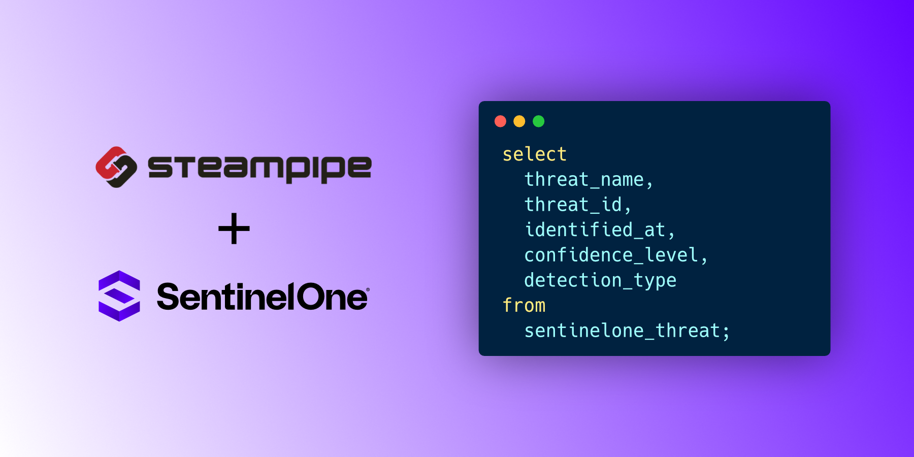

# Steampipe Plugin for SentinelOne

Use SQL to query SentinelOne configuration and more from SentinelOne.

- **[Get started →](https://hub.steampipe.io/plugins/xybytes/sentinelone)**
- Documentation: [Table definitions & examples](https://hub.steampipe.io/plugins/xybytes/sentinelone/tables)
- Community: [Join #steampipe on Slack →](https://turbot.com/community/join)
- Get involved: [Issues](https://github.com/xybytes/steampipe-plugin-sentinelone/issues)


## Quick Start

Install the plugin with [Steampipe](https://steampipe.io):

```shell
steampipe plugin install xybytes/sentinelone
```

Run a query:

```sql+postgres
select
  account_id,
  computer_name,
  agent_version,
  os_name,
from
  sentinelone_agent;
```
## Engines

This plugin is available for the following engines:

| Engine        | Description
|---------------|------------------------------------------
| [Steampipe](https://steampipe.io/docs) | The Steampipe CLI exposes APIs and services as a high-performance relational database, giving you the ability to write SQL-based queries to explore dynamic data. Mods extend Steampipe's capabilities with dashboards, reports, and controls built with simple HCL. The Steampipe CLI is a turnkey solution that includes its own Postgres database, plugin management, and mod support.
| [Postgres FDW](https://steampipe.io/docs/steampipe_postgres/overview) | Steampipe Postgres FDWs are native Postgres Foreign Data Wrappers that translate APIs to foreign tables. Unlike Steampipe CLI, which ships with its own Postgres server instance, the Steampipe Postgres FDWs can be installed in any supported Postgres database version.
| [SQLite Extension](https://steampipe.io/docs/steampipe_sqlite/overview) | Steampipe SQLite Extensions provide SQLite virtual tables that translate your queries into API calls, transparently fetching information from your API or service as you request it.
| [Export](https://steampipe.io/docs/steampipe_export/overview) | Steampipe Plugin Exporters provide a flexible mechanism for exporting information from cloud services and APIs. Each exporter is a stand-alone binary that allows you to extract data using Steampipe plugins without a database.
| [Turbot Pipes](https://turbot.com/pipes/docs) | Turbot Pipes is the only intelligence, automation & security platform built specifically for DevOps. Pipes provide hosted Steampipe database instances, shared dashboards, snapshots, and more.

## Development

To build the plugin and install it in your `.steampipe` directory

```
make
```

Configure the plugin:

```
cp config/* ~/.steampipe/config
vi ~/.steampipe/config/sentinelone.spc
```

Try it!

```
steampipe query
> .inspect sentinelone
```

Further reading:

- [Writing plugins](https://steampipe.io/docs/develop/writing-plugins)
- [Writing your first table](https://steampipe.io/docs/develop/writing-your-first-table)

## Open Source & Contributing

This repository is published under the [Apache 2.0](https://www.apache.org/licenses/LICENSE-2.0) (source code) and [CC BY-NC-ND](https://creativecommons.org/licenses/by-nc-nd/2.0/) (docs) licenses. Please see our [code of conduct](https://github.com/turbot/.github/blob/main/CODE_OF_CONDUCT.md). We look forward to collaborating with you!

[Steampipe](https://steampipe.io) is a product produced from this open source software, exclusively by [Turbot HQ, Inc](https://turbot.com). It is distributed under our commercial terms. Others are allowed to make their own distribution of the software, but cannot use any of the Turbot trademarks, cloud services, etc. You can learn more in our [Open Source FAQ](https://turbot.com/open-source).

## Get Involved

**[Join #steampipe on Slack →](https://turbot.com/community/join)**

Want to help but don't know where to start? Pick up one of the `help wanted` issues:

- [Steampipe](https://github.com/turbot/steampipe/labels/help%20wanted)
- [SentinelOne Plugin](https://github.com/xybytes/steampipe-plugin-sentinelone/issues)
